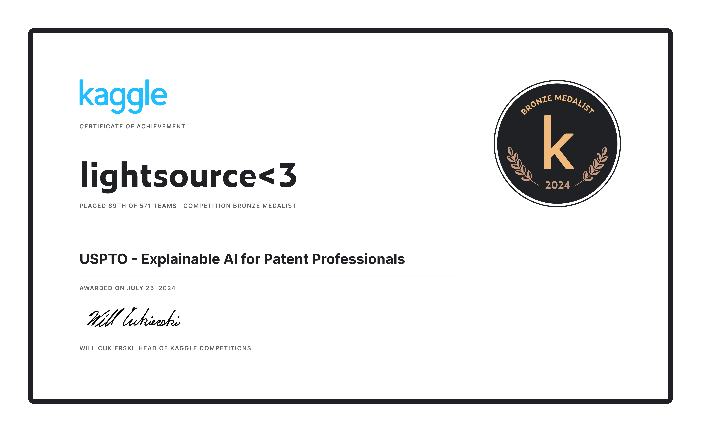

# Radiological Society of North America - Lumbar Spine Degenerative Classification (Kaggle Bronze Medal)

## Description

> The goal of this competition is to create models that can be used to aid in the detection and classification of degenerative spine conditions using lumbar spine MR images. Competitors will develop models that simulate a radiologist's performance in diagnosing spine conditions. 

## Solution

- 3x YOLOv10x 2D-detector as 1st classifier
  - [nfn train script](scripts/lsdc-train-yolo-nfn.py)
  - [scs train script](scripts/lsdc-train-yolo-scs.py)
  - [ss train script](scripts/lsdc-train-yolo-ss.py)
- 1x 3D-ViT model as 2nd classifier
  - [train script](scripts/lsdc-train-vit.py)
- ensembling and TTA on inference
  - [inference script](scripts/lsdc-final-inference.py)

## Certificate

